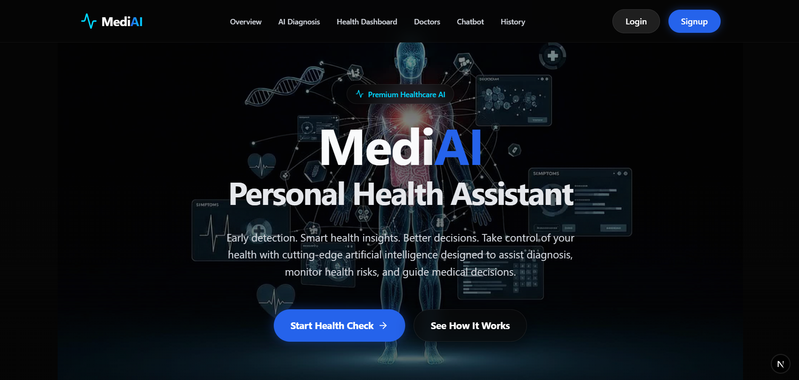
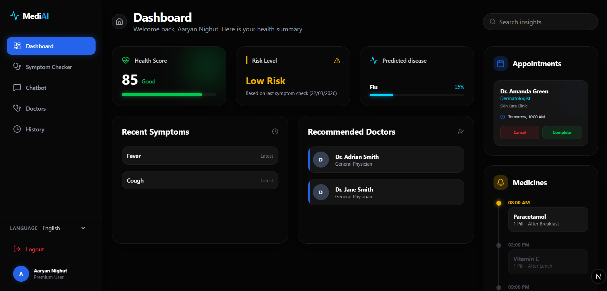
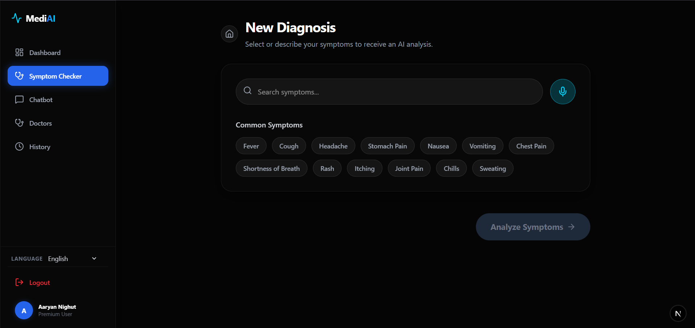
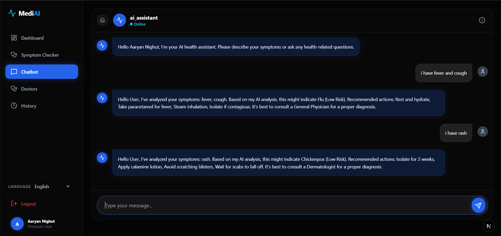
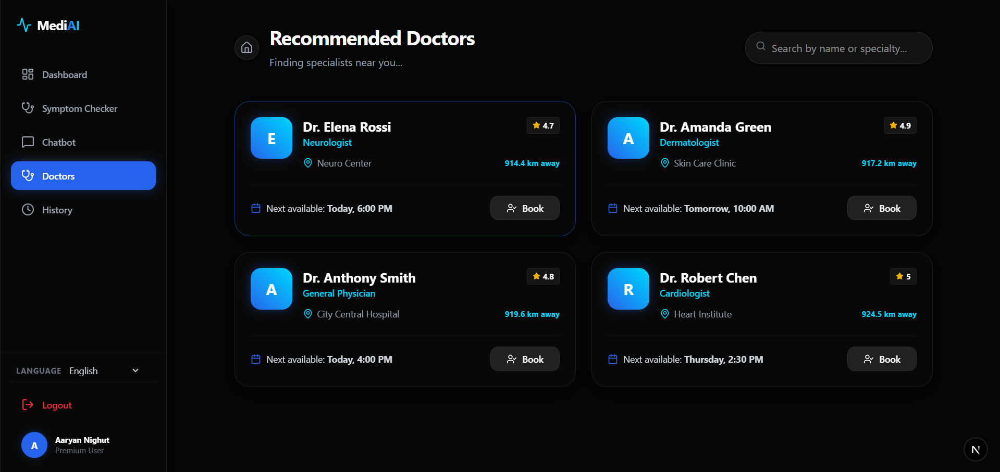
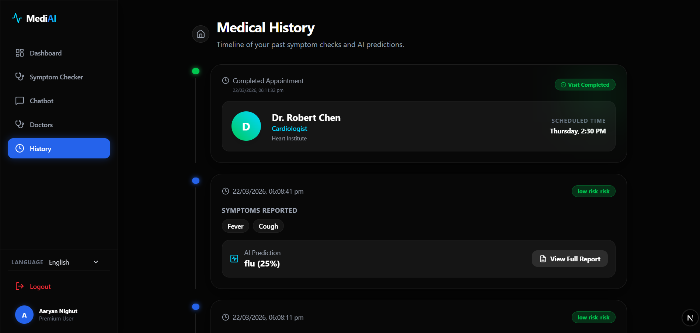

<p align="center">
  
</p>

# MediAI - AI-Powered Healthcare Assistant

[](https://nextjs.org/)
[](https://fastapi.tiangolo.com/)
[](https://www.mongodb.com/)
[](https://react.dev/)

**MediAI** is a cutting-edge, full-stack healthcare platform that leverages Artificial Intelligence to provide instant symptom assessments, disease predictions, and localized doctor recommendations. Designed for accessibility and speed, MediAI bridges the gap between patient symptoms and professional medical consultation.

## 🚀 Key Highlights

- **Real-world healthcare problem solving**: Simplifies the first step of medical consultation.
- **AI + Full-stack integration**: Seamless connection between a Next.js frontend and a FastAPI (ML) backend.
- **Multilingual support (India-focused 🌍)**: Full support for English, Hindi, and Marathi.
- **Voice-enabled accessibility**: Symptom input via voice for better user experience.
- **End-to-end system**: Comprehensive journey from Diagnosis → Doctor Recommendations → Booking → History → Professional PDF Report.

---

## 🏥 Project Overview

In many regions, access to immediate medical advice is limited by geographical or financial barriers. MediAI solves this by providing:
- **Instant AI Assessment**: Rapid disease screening based on user-reported symptoms.
- **Risk Stratification**: Categorization of cases into Low, Medium, or High risk to prioritize urgent care.
- **Bridging the Gap**: Connecting users with nearby specialists after a preliminary check.

---

## ✨ Features

- **🤖 AI Symptom Checker**: Enter symptoms manually or via voice to receive a detailed disease prediction.
- **📈 ML-Based Predictions**: Uses trained Scikit-learn models for high-accuracy disease mapping.
- **🛡️ Risk Level Analysis**: Dynamic feedback on the severity of detected symptoms.
- **📊 Dynamic Dashboard**: Personalized health overview with a "Health Score" and recent activity.
- **🩺 Doctor Recommendations**: Intelligent doctor matching based on predicted symptoms and user location.
- **📅 Appointment Booking**: Seamless booking system for localized specialists.
- **📜 Unified History Timeline**: A complete chronological record of diagnosis results and doctor visits.
- **📄 PDF Reports**: Download professional, detailed medical reports for consultations.
- **🌐 Multilingual Support**: Accessible in English, Hindi, and Marathi.
- **🎙️ Voice Input**: Integrated voice-to-text for simplified symptom reporting.
- **📱 Fully Responsive**: Optimized for both desktop and mobile devices.

---

## 🛠️ Tech Stack

### Frontend
- **Next.js 15 (App Router)**: For high-performance server-side rendering and routing.
- **React 19**: Modern component-based architecture.
- **Tailwind CSS**: For consistent, responsive, and professional UI/UX design.
- **Framer Motion**: For smooth micro-animations and transitions.

### Backend
- **FastAPI (Python)**: High-performance asynchronous API framework.
- **Uvicorn**: ASGI server for running the backend service.

### Database & ML
- **MongoDB**: For flexible, JSON-based storage of user profiles and history.
- **Scikit-learn**: For running the disease prediction machine learning models.
- **Local JSON Data**: For doctor and hospital information management.

---

## 📂 Project Structure

```bash
mediAI/
├── backend/                # FastAPI Backend
│   ├── main.py             # Main entry point & API routes
│   ├── ml_model.py         # AI Heartbeat Logic & ML Inference
│   ├── database.py         # MongoDB connection & config
│   ├── auth.py             # JWT-based Authentication
│   ├── models.py           # Pydantic Schemas & DB Models
│   ├── model.joblib        # Trained Scikit-learn disease model
│   └── requirements.txt    # Python dependencies
├── frontend/               # Next.js Frontend
│   ├── src/
│   │   ├── app/            # App Router (Dashboard, Login, Clinics)
│   │   ├── components/     # Reusable UI Components
│   │   ├── lib/            # API client & localStorage utils
│   │   └── context/        # Global state management
│   ├── public/             # Assets (Logo, Images, Favicons)
│   └── package.json        # Frontend dependencies
├── run.bat                 # Single-click run script for Windows
└── README.md               # You are here
```

---

## 🏗️ System Architecture

1. **User Interaction**: User enters symptoms via Voice or Text on the Next.js Frontend.
2. **API Request**: Frontend sends an asynchronous POST request to the FastAPI Backend.
3. **ML Inference**: Backend executes the Scikit-learn model to process symptoms and predict potential diseases.
4. **Data Persistence**: Results are stored in MongoDB (or local storage for immediate sync).
5. **Real-time Response**: Frontend receives the prediction and displays risk levels, recommendations, and a downloadable report.

---

## 🚀 Installation Guide

### Prerequisites
- Python 3.9+
- Node.js 18+
- Git

### 1. Clone the Repository
```bash
git clone https://github.com/aaryannighut/MediAI.git
cd mediai
```

### 2. Backend Setup
```bash
cd backend
# Create a virtual environment
python -m venv venv
# Activate it (Windows)
.\venv\Scripts\activate
# Install dependencies
pip install -r requirements.txt
# Run the server
uvicorn main:app --reload
```

### 3. Frontend Setup
```bash
cd frontend
# Install dependencies
npm install
# Start the development server
npm run dev
```

### 4. Running Both Simultaneously
You can use the provided root-level script if available:
```bash
# In the root directory
.\run.bat
```

---

## 📖 Usage

1. **Sign Up / Login**: Create a secure account to track your health history.
2. **Enter Symptoms**: Use the "Check Symptoms" tool. Mention all symptoms clearly.
3. **Get Assessment**: Review the AI-predicted disease and risk level.
4. **Book Doctor**: See recommended specialists nearby and book an appointment.
5. **View History**: Access the unified timeline to see all past records.
6. **Download Report**: Export a professional PDF for your doctor.

---

## 📸 Screenshots

### 📸 Landing Page


### 📊 Dashboard


### 🩺 Symptoms Checker


### 💬 Chatbot


### 👨‍⚕️ Doctor Booking


### 📜 History


---

## 🔮 Future Enhancements

- **📅 Real-time Availability**: Integration with hospital scheduling systems for live doctor slots.
- **🤖 Enhanced AI**: Implementation of LLM-based conversational triage.
- **📱 Mobile App**: Dedicated Flutter or React Native mobile application.
- **⌚ Wearable Sync**: Integration with Apple Health and Google Fit for continuous monitoring.
- **☁️ Cloud Deployment**: Full production deployment on Vercel and AWS/Azure.

---

## 🤝 Contribution

1. Fork the project.
2. Create your Feature Branch (`git checkout -b feature/AmazingFeature`).
3. Commit your changes (`git commit -m 'Add some AmazingFeature'`).
4. Push to the branch (`git push origin feature/AmazingFeature`).
5. Open a Pull Request.

---

## 👨‍💻 Author
**MediAI Development Team**

Aaryan Nighut<br>
Aarya Nighut<br>
Ekanksh Mohite<br>
Rahul Yadav

*A Senior software engineer specializing in AI-integrated healthcare solutions.*
